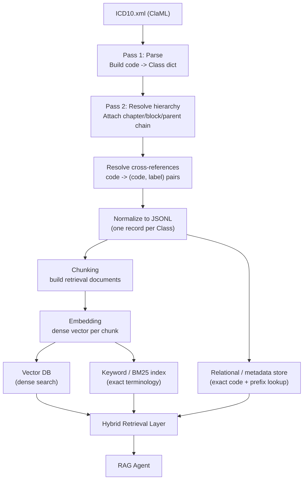
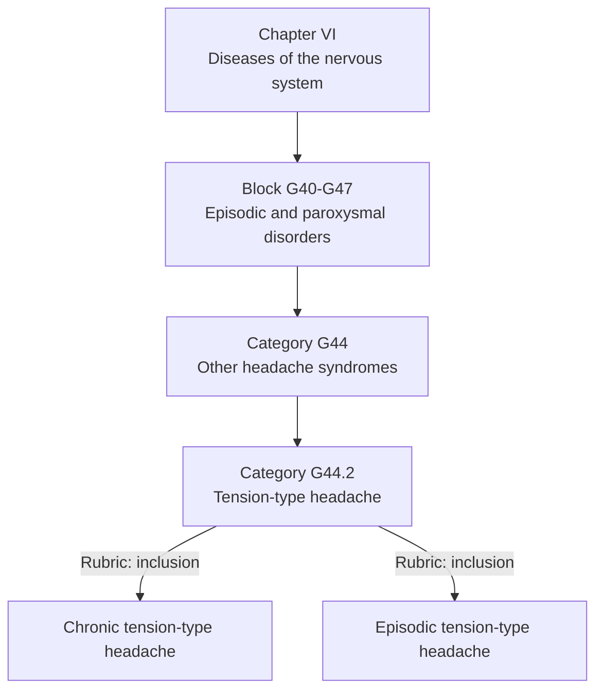
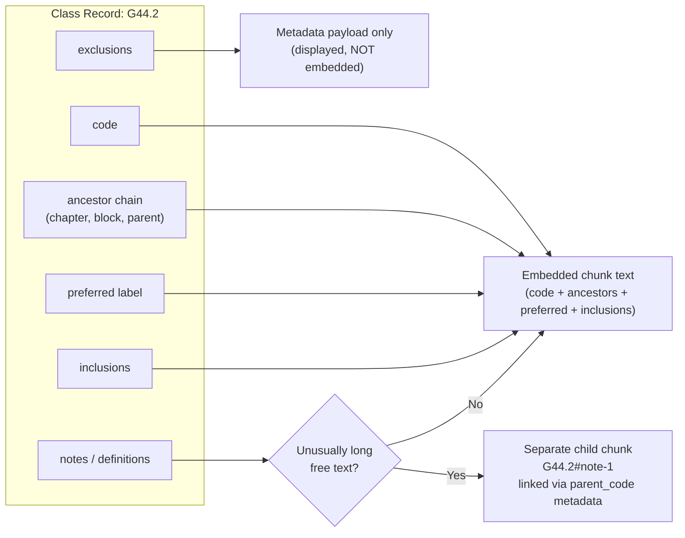
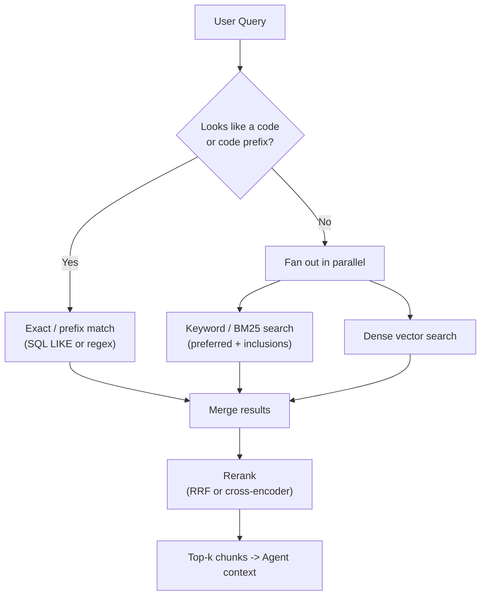
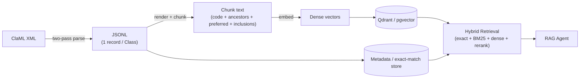

# ICD-10 (ClaML) → RAG Ingestion Design

**Source format:** WHO ClaML XML, `ClaML version="2.0.0"`, dataset `icd10_20210322`
**Goal:** Turn the flat `<Class>` record list into a retrieval corpus usable by an agent, with reliable code-level grounding.

---

## 1. Source Schema Recap

The file is **not** a nested ICD-10 tree — it's a flat list of `<Class>` elements under `<ClaML>`, with parent/child relationships expressed via `SuperClass`/`SubClass` code references rather than XML nesting.

```xml
<Class code="G44.2" kind="category">
    <SuperClass code="G44"/>
    <Rubric kind="preferred">
        <Label xml:lang="en">Tension-type headache</Label>
    </Rubric>
    <Rubric kind="inclusion">
        <Label xml:lang="en">Chronic tension-type headache</Label>
    </Rubric>
</Class>
```

| Element / attribute | Meaning |
|---|---|
| `Class@code` | ICD-10 identifier, e.g. `G44.2` |
| `Class@kind` | `chapter`, `block`, or `category` |
| `SuperClass@code` | Parent code |
| `SubClass@code` | Child code |
| `Rubric@kind` | `preferred`, `preferredLong`, `inclusion`, `exclusion`, `note`, `coding-hint`, `definition`, `introduction`, `footnote`, `text`, `modifierlink` |
| `Label` | Human-readable text (`xml:lang="en"`) |
| `Reference` | Cross-reference to another code/range |

Because hierarchy is reference-based, **the parser must do a two-pass resolution** before anything downstream (chunking, embedding) can happen correctly.

---

## 2. Pipeline Overview



**Why the two-pass parse matters:** a leaf category's context (which chapter/block it belongs to) is what disambiguates it — the same term can appear under multiple chapters (e.g. "burn" under injury vs. late-effect chapters). Ancestor resolution has to happen before chunk text is generated, not at query time.

---

## 3. Hierarchy Resolution Example



This resolved chain (`chapter → block → parent → self`) gets denormalized onto every leaf node's JSON record and, critically, into the **rendered chunk text itself** — not just metadata — because embedding models retrieve better when disambiguating context is inline rather than external.

---

## 4. Intermediate Format: JSONL

XML is a poor RAG substrate (relationships live in attributes, no natural chunk boundary). Convert once to JSONL — this becomes the **source of truth** you re-embed from whenever the embedding model or chunking strategy changes, without re-parsing XML.

```json
{
  "code": "G44.2",
  "kind": "category",
  "chapter": {"code": "VI", "label": "Diseases of the nervous system"},
  "block": {"code": "G40-G47", "label": "Episodic and paroxysmal disorders"},
  "parent": {"code": "G44", "label": "Other headache syndromes"},
  "preferred": "Tension-type headache",
  "inclusions": ["Chronic tension-type headache", "Episodic tension-type headache"],
  "exclusions": [],
  "notes": [],
  "definition": null,
  "cross_references": [],
  "children": []
}
```

---

## 5. Chunking Strategy

**Unit of chunking = one `Class` record**, rendered as structured text. ICD-10 doesn't benefit from token-window/sliding-window splitting — each code is already a self-contained semantic unit, and arbitrary splitting would sever the code↔label↔rubric relationship needed for grounding.



**Rendered chunk template:**

```
Code: G44.2
Category: Other headache syndromes (G44)
Block: Episodic and paroxysmal disorders (G40-G47)
Chapter: Diseases of the nervous system (VI)

Tension-type headache

Includes: Chronic tension-type headache; Episodic tension-type headache
```

Key rules:

- **Prepend ancestor context** into the embedded text itself, not just metadata.
- **Exclude `exclusion` rubrics from the embedding text.** Embedding "Excludes: migraine" into the same vector as "Tension-type headache" risks pulling that chunk toward migraine-related queries. Keep exclusions in the payload for display only.
- **Embed chapters and blocks too**, tagged with `kind: chapter` / `kind: block` in metadata — so a query like "what falls under episodic and paroxysmal disorders" can hit the block chunk, then fan out to children via metadata filter rather than semantic search alone.
- **Split only unusually long rubrics** (rare chapter-level notes/definitions) into their own linked sub-chunk; don't apply a blanket splitter to the whole corpus.
- **One vector per chunk**, roughly one per code — the corpus stays small (tens of thousands of vectors), so this is cheap regardless of DB choice.

---

## 6. Embedding Model

| Option | Trade-off |
|---|---|
| Domain-tuned (SapBERT, PubMedBERT, BioLORD-style) | Better at matching lay symptom phrasing to formal diagnostic terms — worth it since ICD-10 retrieval is fundamentally an entity-linking problem. |
| General-purpose (OpenAI text-embedding-3, Voyage-3, Cohere embed-v4) | Simpler ops, weaker on subtle clinical synonymy. Gap narrows if you exploit `inclusion` rubrics already in the corpus as pseudo-synonyms. |

---

## 7. Vector Database Choice

Constraints that matter more than raw ANN benchmarks at this scale:
- **Small corpus** (tens of thousands of vectors) — nearly any DB is fast enough.
- **Heavy metadata filtering** — chapter, block, code prefix, kind.
- **Exact/prefix lookup is a large fraction of real traffic** ("what is code X", "codes starting with G44") — this is not a vector problem, so pure-vector-only DBs are the wrong sole tool.

| Option | Fit |
|---|---|
| **Qdrant** *(top pick)* | Strong payload/metadata filtering, native hybrid (dense + BM25/sparse) support, easy self-host or cloud, comfortable at this scale. |
| **pgvector (Postgres)** *(top pick)* | Everything in one system: exact/prefix code lookup via SQL, relational joins for ancestor chains, transactional re-ingestion, and vector search together. Best if you don't want a separate vector service. |
| **Weaviate** | Good native hybrid (BM25 + vector fusion), schema-based, similar filtering story to Qdrant. |
| **Chroma** | Great for fast prototyping, weaker for production-grade filtering/scale. |
| **Pinecone / managed** | Fine if you don't want to operate infra; loses SQL-join convenience for hierarchy traversal. |

**Recommendation:** Qdrant or pgvector, paired with a hybrid retrieval layer — pure semantic-only search will underperform on a controlled vocabulary like ICD-10.



---

## 8. Storage Schema (per vector record)

```json
{
  "id": "G44.2",
  "vector": [ ... ],
  "payload": {
    "code": "G44.2",
    "kind": "category",
    "preferred": "Tension-type headache",
    "chapter_code": "VI",
    "chapter_label": "Diseases of the nervous system",
    "block_code": "G40-G47",
    "parent_code": "G44",
    "inclusions": ["Chronic tension-type headache", "..."],
    "exclusions": [],
    "has_children": false,
    "source_version": "icd10_20210322"
  }
}
```

Index as filterable fields: `code`, `kind`, `chapter_code`, `block_code`, `parent_code`.

---

## 9. Versioning & Re-ingestion

WHO revises ICD-10 periodically (this file itself carries `icd10_20210322`, `2019-covid-expanded`). Practices:

- Store `source_version` on every record.
- Make ingestion **idempotent and diffable**: re-parse XML → regenerate JSONL → diff against the previous JSONL by `code` → upsert only changed records into the vector DB, rather than a full reload each time.

---

## 10. Summary

